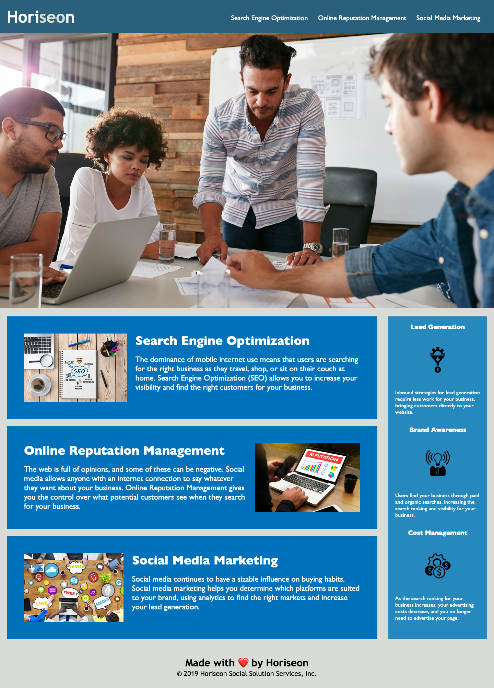

# Homework1 - Horiseon Refactoring

## Table of contents

- [Overview](#overview)
  - [The challenge](#the-challenge)
  - [User Story](#user-story)
  - [Acceptance Criteria](#acceptance-criteria)
  - [Screenshot](#screenshot)
  - [Links](#links)
- [My process](#my-process)
  - [Built with](#built-with)
  - [What I learned](#what-i-learned)
  - [Continued development](#continued-development)
  - [Useful resources](#useful-resources)
- [Author](#author)
- [Acknowledgments](#acknowledgments)

## Overview

### The challenge

Refactor the Horiseon site to make it more accessible. 

### User Story

AS A marketing agency,
I WANT a codebase that follows accessibility standards,
SO THAT our own site is optimized for search engines.

### Acceptance Criteria

GIVEN a webpage meets accessibility standards
WHEN I view the source code
THEN I find semantic HTML elements
WHEN I view the structure of the HTML elements
THEN I find that the elements follow a logical structure independent of styling and positioning
WHEN I view the icon and image elements
THEN I find accessible alt attributes
WHEN I view the heading attributes
THEN they fall in sequential order
WHEN I view the title element
THEN I find a concise, descriptive title

### Screenshot

### Links

- Live Site URL: [Horiseon Website on GitHub](https://niferk.github.io/Horiseon-Social-Solution-Services-SEO-Managemen-h1/)

## My process

### Built with

- Semantic HTML5 markup
- CSS

### What I learned

In this project, gained a deeper understanding of html and CSS. As a complete newbie into the feild, almost all of it was brand new to me. This project was a series of trial and error, that resulted in a substantial acquisition of knowledge in CSS & HTML.

Additionally, I learned more about web accessability and why it is important, as well as it's added benefits that make accessible sites better positioned for search engines like Google.

There are both obvious and more nuanced knowlege that I gained during this project, but here is a few examples:

1. I learned that there are default rules for elements within elements. For instance, default rules for h1 are different if it's inside a section:
https://stackoverflow.com/questions/26290849/why-is-size-of-h1-different-inside-a-section-element

2. I learned that nesting/order of html elements, is crucial, and can completely break a page. Specifically, I had CSS that just won't cooperate, even after hours of work and my attempts to take a objective look at my HTML. I asked a collegue to peek at it, and those fresh pair of eyes are just what solved the issue.

3. I learned that semantic elements and notations really do help organize an HTML file better. When returning to my project, it was always easy to glean my code and navigate.

## Author

- LinkedIn - [Nifer Kilakila](https://www.linkedin.com/in/nifer-kilakila-b0721565/)
- GitHub - [@NiferK](https://github.com/NiferK)

## Acknowledgments

Many thanks to Nolan Spence, a classmate, who helped spot an error on a problem that I was banging my head against for hours. It was a mere 3 minutes and he solved it. Thanks!
